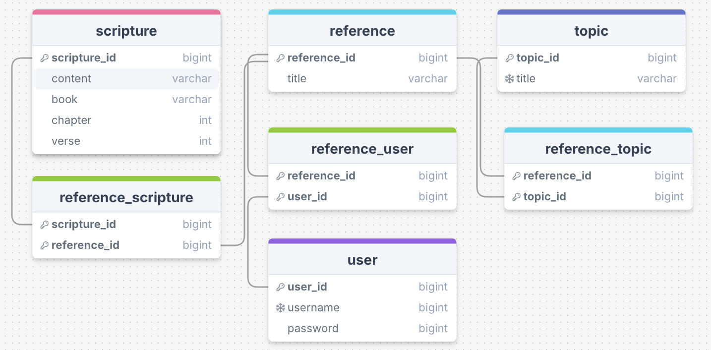

# LearnOfChrist

## Introduction

In 2017, while speaking to young adult members of the Church of Jesus Christ of Latter-day Saints, President Russell M. Nelson gave the following challenge:

> Commence tonight to consecrate a portion of your time each week to studying everything Jesus said and did as recorded in the Old Testament, for He is the Jehovah of the Old Testament. Study His laws as recorded in the New Testament, for He is its Christ. Study His doctrine as recorded in the Book of Mormon, for there is no book of scripture in which His mission and His ministry are more clearly revealed. And study His words as recorded in the Doctrine and Covenants, for He continues to teach His people in this dispensation.

He then directed those willing to take the challenge to use the topical guide to help them.

> To assist you, refer to the Topical Guide for references under the topic “Jesus Christ.”

[Link to the full address](https://www.churchofjesuschrist.org/media/video/2017-01-1000-worldwide-devotional-january-2017?lang=eng&alang=eng&collectionId=951fc19a58ee4fa9bc6ea207fcf2b557)

I have personally attempted this challenge several times and, though I'm not blaming this for my failures to finish, it was hard to keep track of what I had read. So, I have decided to create a web app to help me and other individuals who would like to take this challenge in tracking their progress.

## Data

Here is the initial model I have in mind for keeping track of users and scripture data.

## Timeline

Tentative timeline for completion:

- 3/19 - Have all scripture data in Supabase.
- 3/26 - Build out backend endpoints, services, DAOs, etc.
- 4/2 - Build out frontend.
- 4/9 - Deploy backend services to AWS lambdas, frontend to S3, CloudFront.
- 4/16 - Wiggle room/wrapping up project.
